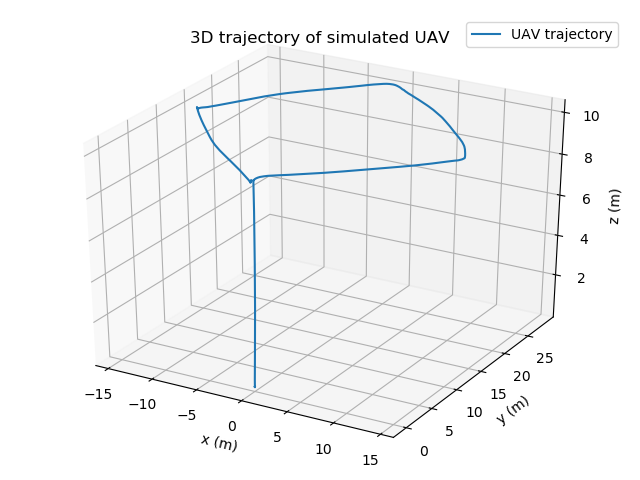

# UAV PID control

Basic (but working) cascade PID position controller for a UAV under the ROS 1 framework

> Core controller lib: `include/uav_pid_control/pid_controller.h` is ROS agnostic. WIP to rewrite the ROS wrapper to ROS 2



To reproduce this figure, run

1. Launch PX4 mavros simulation `roslaunch px4 mavros_posix_sitl.launch`
2. Launch controller `roslaunch uav_pid_control uav_pid_control.launch
3. Launch script to stream setpoints `python3 scripts/demo_uav_pid_control.py`

## Dependencies

Eigen3. Install with

``` bash
sudo apt-get install libeigen3-dev
```

## Building

Clone this package to `your_ros_ws/src`, then run

``` bash
catkin build
```

## API walkthrough

1. Construct the Controller object

    ``` C++
    control::PIDController<double> ctl;
    ```

2. Fill in the parameter struct then call `control::PIDController::loadParams`

    ``` C++
    control::PIDController<double>::Params params;
    params.kp_pos = Eigen::Vector3d(x, y, z);
    // etc...
    // TODO: Document the meaning of the parameters
    ctl.loadParams(params);
    ```

3. Upon sensor updates, invoke the following setters of vehicle states

    ``` C++
    ctl.position() = enu_coords;
    ctl.velocity() = world_frame_velocity;
    ```

4. When assigning a control objective, invoke the following setters of setpoints

    ``` C++
    ctl.position_sp() = destination_in_enu_coords;
    ctl.yaw_sp() = heading_angle;
    ctl.pause_integration() = is_sensor_outlier; // Or some other predicate
    ```

5. In the main loop, run the following "main" function

    ``` C++
    double dt = 1e3 * millis() - last_call; // Time interval
    ctl.run(dt);
    ```

6. Get the normalized throttle/orientation setpoint (Exactly corresponding to Mavros's `mavros_msgs::AttitudeTarget` message) and forward to lower-level attitude controllers

    ``` C++
    mavros_msgs::AttitudeTarget target;
    target.orientation = tf2::toMsg(ctl.orientation_sp());
    target.thrust = ctl.throttle_sp();
    ```

7. Log internal states?

    ``` C++
    Eigen::IOFormat fmt_spec(StreamPrecision, 0, ", ", ";\n", "", "", "[", "]");
    LOG(INFO) << ctl.position_error().transpose().format(fmt_spec);
    LOG(INFO) << ctl.velocity_error().transpose().format(fmt_spec);
    ```
